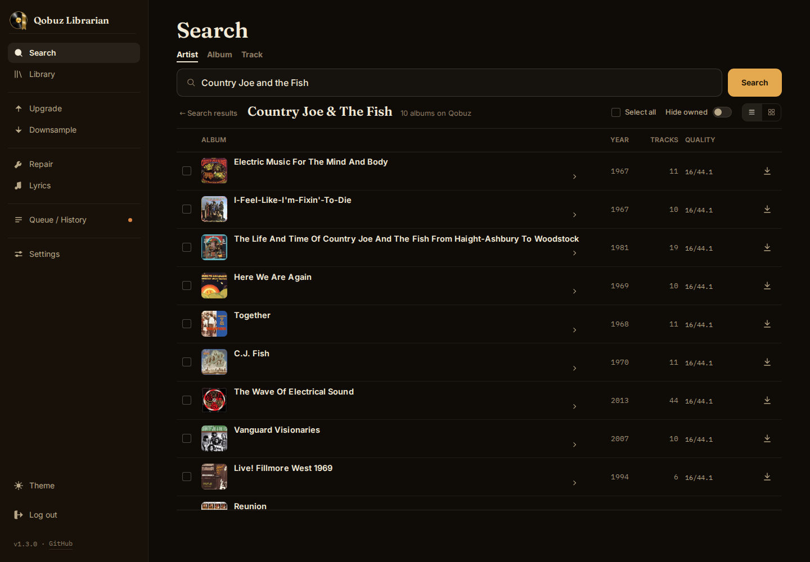

<p align="center">
  <picture>
    <source media="(prefers-color-scheme: dark)" srcset="assets/logo-dark.png">
    
  </picture>
</p>

<p align="center"><em>Build and maintain a complete, lossless library from Qobuz.</em></p>

<p align="center">
  <a href="https://github.com/jarynclouatre/qobuz-librarian/actions/workflows/test.yml"></a>
  <a href="https://github.com/jarynclouatre/qobuz-librarian/actions/workflows/docker.yml"></a>
  <a href="LICENSE"></a>
  
</p>

Qobuz Librarian searches Qobuz for artists, albums, and tracks, downloads what you choose, and imports it with [beets](https://beets.io/). It also scans your local library for missing albums, albums missing tracks, quality upgrades, damaged files, and missing lyrics.

<p align="center">
  
</p>

## Features

- **Missing albums and Gap Fill.** Run a Library scan to find missing albums from artists already in your library, plus albums you own that are missing tracks (Gap Fill). Download only what you choose. The app tracks its own downloads; if music lands in the folders from outside it, the refresh icon in the Library header folds the new finds into the review you already have open, keeping your picks. Matching is edition-aware, so remasters and deluxe versions are not re-downloaded as duplicates. When an album is already in your library, search folds other pressings under **other versions**; pick **Download** to keep a remaster or deluxe alongside it.
- **Single tracks.** Switch search to **Track** to download an individual track. By default this does not hide the rest of the album from future gap scans; there is a setting if you want single-track downloads treated as deliberate singles.
- **Verified quality.** Every download is checked against the actual FLACs Qobuz served. If they come in below what your quality setting implies, the app retries once from the higher source; anything it cannot resolve is flagged in History instead of slipping into your library silently.
- **Quality upgrades.** The Library refresh finds albums Qobuz can now serve at higher quality. Review and queue them from **Upgrade**, or set `UPGRADE_SCAN_ENABLED=false` to hide Upgrade and skip that pass entirely.
- **Downsample.** Convert hi-res FLACs to 44.1 / 48 kHz FLAC to reclaim space. Run it on demand, or apply it automatically to new downloads.
- **New releases.** A periodic pass lists new albums by artists in your library for review and leaves them un-ticked so they cannot all be queued by accident.
- **Discover.** With a Last.fm API key saved, a Discover tab suggests artists like the ones already in your library and names the artists that vouch for each, browses the genres of your library, searches for artists similar to a name you type, and lists the albums you saved on Qobuz that are not on disk yet. Suggested artists and albums are resolved on Qobuz, and short single-track releases are left out.
- **Clean import.** beets handles tagging and cover art, and files land in your library in a single move. Lyrics are fetched on import; **Lyrics** mode backfills tracks you already have.
- **Repair.** ISRC-anchored scanning finds truncated or corrupt FLACs and refills exact tracks when the ISRC resolves to that same recording. Damage is found whatever the tag says, but a file whose ISRC is missing, unmatched, or names a different song is never offered a single-track swap; the review offers a whole-album redownload instead.
- **Library migration.** Reorganise an existing library into the folder structure `Artist/Album (Year)`. Copy mode leaves the original library in place; optional move mode relocates originals after preview. Merging existing duplicate album folders is a CLI-only option.
- **Collection backup.** After each library scan, a JSON list of every artist, album and track in your library is written to a folder you choose, with the Qobuz ids the app has resolved. Five dated copies are kept. A backup that comes back empty or much smaller than the last one is held until you confirm it, so an unmounted drive cannot overwrite a good copy. Upload a backup file again later and the app lists every album in it that is not in your library, as one review to download from.
- **Crash-safe queue.** Job records and review lists survive restarts; interrupted downloads are marked failed and can be retried. A shared run lock keeps the web app and CLI from writing at the same time within one deployment.

## How it works

A single Docker image bundles streamrip, beets, ffmpeg, and the FLAC tools, with no sidecar containers. The web UI is the primary interface; the CLI runs the same engine for scripted or unattended jobs. Day-to-day behaviour (quality, lyrics, artwork, beets layout, scan cadence) lives on the **Settings** page; paths, ports, and a few advanced knobs come from environment variables (see [Configuration](docs/configuration.md)).

Most scan modes work the same way: **scan → review → act.** A scan runs in the background and saves a checklist of findings, and nothing changes on disk until items are selected and approved. Two exceptions: Search downloads straight from its results, and Lyrics writes missing lyrics as the job runs.

| Page | What it does |
|---|---|
| **Search** | Find artists, albums, or tracks and download from the results |
| **Library** | Find missing albums and Gap Fill candidates, then check for new releases |
| **Discover** | Suggested artists, library genres, similar-artist search, and your saved Qobuz albums (needs a Last.fm API key) |
| **Upgrade** | Re-rip albums Qobuz can now serve at higher quality |
| **Downsample** | Bring hi-res files down to 44.1 / 48 kHz (local, no login) |
| **Repair** | Refill truncated or partial FLACs (ISRC-verified) |
| **Lyrics** | Fetch lyrics for tracks missing them (no Qobuz login; uses internet lyric websites) |
| **Library migration** (on Settings) | Reorganise an existing library into the folder structure `Artist/Album (Year)` (copies by default; optional move mode) |
| **Queue / History** | Running and waiting work, plus a record of finished jobs |
| **Settings** | Qobuz credentials, behaviour toggles, paths, and diagnostics |

By default, new downloads use tier 4: the best quality Qobuz serves for the release (24-bit up to 192 kHz, down to CD lossless). Change the tier on **Settings** or with `STREAMRIP_QUALITY`; see [Configuration](docs/configuration.md#download-quality).

## Quick start (Docker)

```bash
mkdir qobuz-librarian && cd qobuz-librarian
curl -O https://raw.githubusercontent.com/jarynclouatre/qobuz-librarian/main/compose.yaml
curl -O https://raw.githubusercontent.com/jarynclouatre/qobuz-librarian/main/.env.example
cp .env.example .env
# edit .env: at minimum, point QL_MUSIC_DIR at your music folder
mkdir -p music   # skip if QL_MUSIC_DIR points at an existing folder
docker compose up -d
```

Then open <http://localhost:8666>. The first visit sets a web username and password; sign in, paste your Qobuz token on **Settings** (see below), and search for an artist, album, or track. After you connect, the Search page offers a one-time baseline scan to learn what is already in your library; run it or skip it.

> **Point `QL_MUSIC_DIR` at a dedicated music library**, not your home folder or a drive with other files mixed in. The app moves and merges files within that tree, and Upgrade replaces files in place.

On Windows, run the setup in WSL or Git Bash. `compose.yaml` pulls the prebuilt `latest` image from Docker Hub as `dinkeyes/qobuz-librarian` (that account name differs from the GitHub project, which is expected); to build it yourself, see [Development](#development). On a shared or untrusted network, lock down access before the first boot; see [Security](#security).

Docker is the supported way to run the **web UI**: the image bundles streamrip, beets 2.13.1, the FLAC tools, and the compiled stylesheet. Installing from the repo gives you the `qobuz-librarian` **CLI** for scripted runs against an existing streamrip/beets 2.13.1 setup: `pipx install 'qobuz-librarian[lyrics] @ git+https://github.com/jarynclouatre/qobuz-librarian.git'` (or the same spec with `pip`; the `[lyrics]` extra covers the lyrics features Docker already bundles). The Python package also includes the compiled web assets and the `qobuz-librarian-web` command, but you still provide streamrip, beets, and the audio tools outside Docker. If beets uses a separate environment and its `beet` launcher has an unusual wrapper, set `BEETS_PYTHON` to that environment's Python executable.

### Updating Docker

Run these commands from the directory that holds `compose.yaml` and `.env`:

```bash
docker compose pull
docker compose up -d
docker compose ps
docker compose exec qobuz-librarian qobuz-librarian --version
```

`pull` downloads the current image, then `up -d` recreates the service when that image has changed. `docker compose restart` alone keeps the existing container on its old image. Named config and data volumes, along with the music, staging, and backup bind mounts, remain in place during recreation. `docker compose ps` should settle on `healthy`, and the reported application version should match the release you expected to install. The container health check uses `/readyz` to catch an unreadable login, unavailable data directory, unavailable Queue/History database, or unsafe single-writer lock; `/healthz` remains a process-only liveness check. A deliberate read-only pause stays healthy so Settings and Diagnostics remain usable.

### Your Qobuz token

Auth is by token, not your password. You need a paid Qobuz account; this only downloads what your subscription entitles you to.

Get the token from the [Qobuz web player](https://play.qobuz.com): sign in, open dev tools (F12), and find Local Storage for `play.qobuz.com` (**Application** tab in Chrome/Edge, **Storage** in Firefox). Open the `localuser` entry and copy its `token` value; the `id` field next to it is your user id. Paste the token into **Auth token** on Settings; **Email or user ID** takes either your email or that numeric id. Credentials stay in the container and are used only for Qobuz authentication.

The token is enough for Search, Library, Discover, New Releases, Upgrade, and Repair. Downloads also need the email or user ID because streamrip uses it to start a Qobuz download.

If you already run streamrip elsewhere, copy `password_or_token` from `~/.config/streamrip/config.toml` instead.

## Documentation

- **[Configuration](docs/configuration.md)**: environment variables, download quality, beets/streamrip config, NAS permissions, and what the app does on its own.
- **[Existing libraries](docs/existing-libraries.md)**: the folder layout it expects, migration options, bringing your own beets database, and the first big scan.
- **[CLI](docs/cli.md)**: running the same engine from the terminal.
- **[JSON API](docs/api.md)**: read-only job state for dashboards and scripts.
- **[Troubleshooting](docs/troubleshooting.md)**: common errors and what to check.

## Security

The web UI requires sign-in by default: a single shared credential, stored as a salted PBKDF2 hash, with brute-force limiting per source IP and per username. Wrong guesses are refused for a while once the limit is reached, and so is the correct password until the wait clears; a browser that is already signed in is never counted. Behind a reverse proxy, set `FORWARDED_ALLOW_IPS` (see [Configuration](docs/configuration.md#deployment)) or the limit counts every visitor as one. The bundled `compose.yaml` ships hardened (`no-new-privileges`, `cap_drop: [ALL]`, memory and PID limits) and runs as `PUID:PGID` rather than root; credential files are written `0600` by the entrypoint and the app.

On first boot there is no account yet, and the setup screen stays open until one is created. New and reset passwords need at least 15 characters; common and product-name passwords are refused. On a shared or untrusted network, seed `WEB_AUTH_USER` / `WEB_AUTH_PASSWORD` in `.env`, or set `WEB_BIND=127.0.0.1` to keep the port off the LAN, before starting the container. On a private home LAN, creating the account promptly is usually sufficient.

For internet exposure, put it behind an authenticating reverse proxy, a VPN, or Tailscale rather than relying on the built-in login alone. See [SECURITY.md](SECURITY.md), and [Configuration](docs/configuration.md#deployment) for the deployment knobs.

## Operational limitations

- **Stop before database maintenance.** Never sync, restore, or replace the live beets/SQLite database while Qobuz Librarian is running; stop the app first.
- **A repair that can't prove itself keeps a backup.** Repair moves the files it replaces (or the full original album, for whole-album Repair) into a recovery backup and removes it once every replacement verifies. When that proof can't complete, the backup is kept and flagged on Settings → Diagnostics, and the job page states what actually happened to the files: the replacement may already be in the album with your original only in the backup. Review both before restoring or removing it.
- **Some filesystem metadata may differ after a copy.** Cross-filesystem migrations and safety backups preserve the music and ordinary file metadata, but do not guarantee exact extended attributes, access-control lists (ACLs), or file ownership.
- **One library, one container.** The staging area is single-writer. The run-lock keeps the CLI and web container from running at the same time in one stack, but two stacks pointed at the same mount can still conflict.
- **Qobuz only.** This drives streamrip's Qobuz path; Tidal, Deezer, and SoundCloud are not supported.
- **FLAC output only.** Imports, repairs, upgrades, and downsampling keep the library in FLAC; MP3 and other lossy output formats are not supported.
- **Latin-script matching is strongest.** Fuzzy matching was tuned on Latin-script artist and album titles. CJK and right-to-left titles work, but edition-stripping uses English keyword lists.
- **PWA install needs HTTPS.** The service worker only activates on HTTPS or `localhost`, so front the container with a TLS proxy to install it as an app.

## Development

```bash
python3 -m venv .venv
source .venv/bin/activate      # PowerShell: .venv\Scripts\Activate.ps1
pip install -e ".[test]"
python -m pytest -q
```

To build the Docker image from a checkout:

```bash
git clone https://github.com/jarynclouatre/qobuz-librarian.git
cd qobuz-librarian
cp .env.example .env
docker compose -f compose.yaml -f compose.dev.yaml up -d --build
```

The wheel includes the compiled stylesheet. When changing templates or styles in a source checkout, rebuild it with `npm ci && npm run build`; the image build does this too. `ruff check src tests` runs in CI. See [CONTRIBUTING.md](CONTRIBUTING.md) for the rest.

## Acknowledgements

Qobuz Librarian is glue around several open-source projects, bundled into the Docker image:

- **[streamrip](https://github.com/nathom/streamrip)** (nathom): the Qobuz downloader. GPL-3.0.
- **[beets](https://beets.io/)**: tagging, cover art, library organisation. MIT.
- **[mutagen](https://github.com/quodlibet/mutagen)**: audio metadata reading/writing. GPL-2.0-or-later.
- **[FFmpeg](https://ffmpeg.org/)**: audio probing and transcoding. LGPL/GPL depending on build.
- **[FLAC](https://xiph.org/flac/)** (Xiph.Org): integrity verification and header reads. BSD.

Lyrics come via [syncedlyrics](https://github.com/moehmeni/syncedlyrics) (LRCLIB, NetEase, Megalobiz, Musixmatch, Genius). The web UI uses [FastAPI](https://fastapi.tiangolo.com/), [htmx](https://htmx.org/), and [Tailwind CSS](https://tailwindcss.com/) with Qobuz Librarian's own `ql-*` component layer. Thanks to all their maintainers.

## License

This project's own code is **MIT**; see [LICENSE](LICENSE).

The Docker image redistributes the third-party tools above, each under its own licence. Two are copyleft and coupled differently: **streamrip (GPL-3.0)** is invoked as a separate program (a subprocess), while **mutagen (GPL-2.0-or-later)** is imported as a Python library. If you redistribute the image or a derivative, honour both projects' terms.
